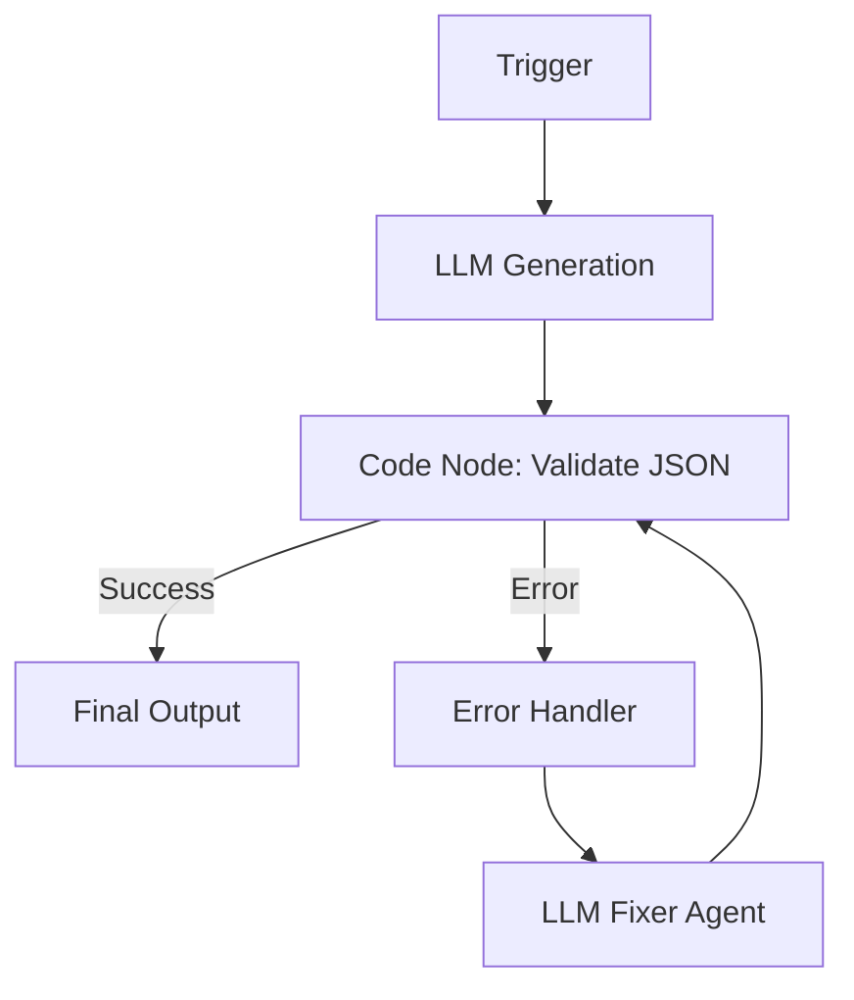

# Self-Correcting LLM Agent Workflow Design

## Overview
This document outlines a design for a robust, self-correcting n8n workflow that uses an LLM to generate structured data (JSON), validates it against a strict schema, and automatically attempts to fix errors (parsing, schema violations) using an Agentic loop or a workflow-level feedback loop.

### Goals
1.  **Reliability**: Ensure the final output is always valid JSON adhering to a specific model.
2.  **Autonomy**: The agent should detect its own mistakes (e.g., Markdown wrapping, missing keys) and fix them without failing the workflow.
3.  **Resilience**: Use try-catch mechanisms to handle unexpected failures gracefully.

---

## Architecture Patterns

We propose two architectural patterns:
1.  **The "Agentic Tool" Pattern** (Recommended for N8N AI Agent Nodes)
2.  **The "Workflow Loop" Pattern** (Recommended for explicit control flow)

### Pattern 1: The Agentic Tool Pattern
In this pattern, a single **AI Agent Node** is equipped with a custom "Validation Tool". The LLM is instructed to *use* this tool to check its own work before returning a final answer.

**Components:**
*   **AI Agent Node**: The orchestrator.
*   **Custom Tool (Code)**: A Javascript function (or Zod schema validator) exposed to the Agent.
    *   *Input*: JSON String, Schema (optional).
    *   *Output*: `{"valid": true}` or `{"valid": false, "error": "Missing key 'email'"}`.

**Flow:**
1.  Agent generates draft JSON.
2.  Agent calls `validate_data(draft_json)`.
3.  Tool returns error message.
4.  Agent observes error, iterates thought process: "I missed the email field. I will rewrite the JSON."
5.  Agent calls `validate_data(new_json)`.
6.  Tool returns success.
7.  Agent outputs final JSON.

### Pattern 2: The Workflow Loop Pattern (Try-Catch-Retry)
In this pattern, the validation happens *outside* the LLM node. If validation fails, the workflow loops back to the LLM with the error context.

**Components:**
*   **LLM Node** (Basic Chain or Agent): Generates Content.
*   **Code Node (Validator)**: Parses JSON and validates Schema (e.g., using `ajv` or simple JS). Throws error if invalid.
*   **Error Trigger / If Node**: Detects failure.
*   **Fixer LLM**: Receives `Original Prompt` + `Bad Output` + `Error Message`. Generates correction.

**Diagram:**


---

## Detailed Implementation (Pattern 1: Agentic Tool)

This suggests how to build the "Agentic Tool" version using `n8n-mcp` principles or standard n8n nodes.

### 1. The Validation Tool (Code Tool)
Create a **Code Tool** connected to the AI Agent.
*   **Name**: `validate_json_schema`
*   **Description**: "Validates a JSON string against the required 'User Profile' schema. Use this to check your work."
*   **Schema (Zod)**:
    ```javascript
    z.object({
      json_string: z.string().describe("The JSON string to validate"),
    })
    ```
*   **Code**:
    ```javascript
    const schema = {
        "required": ["name", "age", "email"],
        "properties": {
            "name": { "type": "string" },
            "age": { "type": "number" },
            "email": { "type": "string" }
        }
    };

    try {
        const data = JSON.parse(input.json_string);
        // Simple schema check (or use AJV library if available)
        const missing = schema.required.filter(key => !data.hasOwnProperty(key));
        if (missing.length > 0) {
            return `Validation Failed: Missing keys: ${missing.join(", ")}`;
        }
        return "Validation Successful. The JSON is correct.";
    } catch (e) {
        return `Validation Failed: Invalid JSON format. Error: ${e.message}`;
    }
    ```

### 2. The Agent Configuration
*   **System Message**:
    > You are a data extraction assistant. Your goal is to produce a valid JSON object representing the user.
    > CONSTANTLY VALIDATE YOUR OUTPUT.
    > 1. Generate the JSON.
    > 2. Call the `validate_json_schema` tool with your generated JSON.
    > 3. If the tool returns an error, examine the error, fix your JSON, and call validate again.
    > 4. ONLY output the final validated JSON string when the tool returns success.

---

## Detailed Implementation (Pattern 2: Robust Workflow Loop)

This pattern is better for "fire and forget" reliability where you want explicit retry limits.

### steps
1.  **Switch**: Start the loop.
2.  **LLM Node**: Generate text.
3.  **Code Node**:
    ```javascript
    try {
      const json = JSON.parse($input.item.json.text);
      if (!json.summary) throw new Error("Missing summary");
      return json; // Pass to next node
    } catch (error) {
       // Tag item as error
       return { json: { error: error.message, original: $input.item.json.text } };
    }
    ```
4.  **If Node**: Check if `json.error` exists.
    *   **True (Error)**: Route to **Fixer Node**.
    *   **False (Success)**: Proceed.
5.  **Fixer Node (LLM)**:
    *   **Prompt**:
        > You are a JSON fixer.
        > The previous attempt failed with error: `{{$json.error}}`.
        > The invalid output was: `{{$json.original}}`.
        > Please output the CORRECTED JSON only.

---

## Recommendation

For the **Hackathon Spike**, we recommend **Pattern 1 (Agentic Tool)** because:
1.  It leverages the power of the "AI Agent" node (new in n8n).
2.  It encapsulates the loop logic *inside* the model's reasoning, reducing the number of nodes in the graph.
3.  It feels more "intelligent" and capable of handling nuanced errors.

However, ensure you set a **Maximum Iterations** (e.g., 5) on the Agent node to prevent infinite loops if the model gets stuck.
